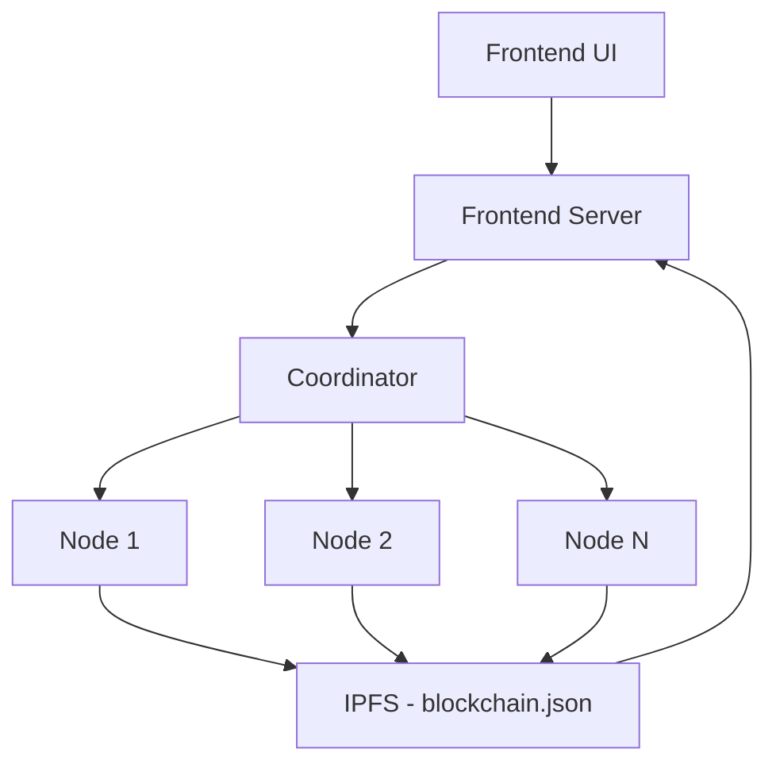

# 🧠 Decentralized LLM Network

An open-source, decentralized network for running and querying Large Language Models (LLMs) across distributed peer nodes. Built using **FastAPI**, **IPFS**, and **HuggingFace Transformers**, this project enables serverless, censorship-resistant AI inference powered by decentralized coordination.

> ⚡ No central server. No cloud lock-in. Just distributed intelligence.

---

## 🧩 Features

- ⚙️ **Decentralized Node Discovery** via `blockchain.json` on IPFS  
- 🚀 **Peer-to-peer LLM Serving** — GPT-2 or any HuggingFace model  
- 🌐 **Frontend Control Panel**: View active nodes and their metadata  
- 🛡 **No centralized backend**  
- 🔄 **Coordinator auto-picks live node** and routes query  
- 🔧 **Configurable via `node_config.json`**

---

## 📐 Architecture



---

## 📁 Project Structure

```
decentralized-llm-network/
├── node/                      # Node server running LLM
│   ├── node.py
│   ├── node_config.json       # Metadata for registration
│   ├── current_cid.txt        # IPFS CID reference
│   └── blockchain_folder/
│       └── blockchain.json    # Decentralized registry
│
├── coordinator/               # Load balancer & query router
│   └── coordinator.py
│
├── frontend/                  # HTML + JS client
│   └── index.html
│
├── frontend_server.py         # Serves frontend & proxies IPFS
├── requirements.txt
├── README.md
├── LICENSE
└── .gitignore
```

---

## ⚙️ Prerequisites

- Python 3.10+
- [IPFS CLI](https://docs.ipfs.tech/install/)

```bash
ipfs init
ipfs daemon
```

---

## 🚀 Getting Started

### 1️⃣ Clone & Install

```bash
git clone https://github.com/sagar117/Decentralised-LLM.git
cd Decentralised-LLM
pip install -r requirements.txt
```

---

### 2️⃣ Start IPFS

```bash
ipfs daemon
```

---

### 3️⃣ Launch a Node

Edit the file `node/node_config.json`:

```json
{
  "model": "gpt2",
  "hardware": "CPU",
  "max_tokens": 100,
  "supports_streaming": false,
  "inference_server": true
}
```

Then run:

```bash
cd node
uvicorn node:app --host 192.168.1.X --port 8001
```

This will:

- Load current `CID` from `current_cid.txt`
- Download latest `blockchain.json`
- Add this node's metadata
- Re-upload new version to IPFS
- Update `current_cid.txt` with new CID

---

### 4️⃣ Start the Frontend Server

```bash
python3 frontend_server.py
```

- Serves the UI at [http://127.0.0.1:5500](http://127.0.0.1:5500)
- Serves `current_cid.txt` so frontend can access IPFS from JS
- Prevents CORS issues

---

### 5️⃣ Start the Coordinator

```bash
cd coordinator
uvicorn coordinator:app --port 8000
```

- Reads latest `CID` from `current_cid.txt`
- Pulls `blockchain.json` from IPFS
- Picks a live node and forwards queries

---

## 🧠 Frontend Features

- 📡 Submit a prompt to any live node  
- 🔍 Shows which node handled the request  
- 💡 Displays metadata: IP, model, hardware  
- 🌐 Fetches node list via IPFS  

---

## 🔐 Node Config Options

| Field              | Description                           |
|--------------------|----------------------------------------|
| `model`            | LLM to run (`gpt2`, `mistral`, etc.)   |
| `hardware`         | Hardware type (`CPU`, `GPU`)           |
| `max_tokens`       | Max token limit                        |
| `supports_streaming` | Supports streamed inference          |
| `inference_server` | Whether it's a full model runner       |

Defined in: `node_config.json`

---

## 📦 IPFS Node Registry

Each node updates a decentralized registry (`blockchain.json`) stored on IPFS.

Example entry:

```json
{
  "host": "192.168.1.5",
  "port": "8001",
  "model": "gpt2",
  "hardware": "CPU",
  "max_tokens": 100,
  "supports_streaming": false,
  "inference_server": true,
  "last_seen": "2025-05-03T14:00:00Z"
}
```

Updated via:

```bash
ipfs add -r blockchain_folder
```

CID saved in `current_cid.txt`

---

## 🛣 Roadmap

### ✅ In Progress

- 🔄 Node heartbeat / last_seen updater  
- 🧬 CID fallback retries + auto refresh  
- 🌐 IPNS-based CID aliasing  
- 🧪 Basic query logging + UI display  

---

### 🧠 Future

- 📊 Node dashboard with uptime & logs  
- 🧬 Multi-model support (Mistral, LLaMA)  
- 💬 Live chat UX in frontend  
- 🔐 Signed node registrations  
- 💰 Token reward system for serving nodes  
- 🖥 CLI tool for node management  

---

## 🧾 License

MIT License.  
Free to use, fork, modify, and share.

---

## 🤝 Contributing

PRs welcome!  
Please open issues for bugs, suggestions, or feature ideas.

---

## 🙏 Acknowledgments

- 🤗 HuggingFace Transformers  
- ⚡ FastAPI  
- 🕸 IPFS  
- 🧠 Open Source Community

---

> Built with ❤️ to decentralize LLMs and democratize intelligence.
